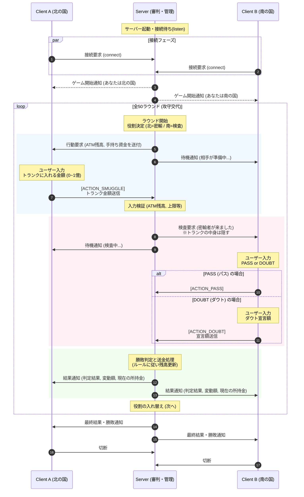

```mermaid
sequenceDiagram
    autonumber
    participant N as Client A (北の国)
    participant S as Server (審判・管理)
    participant Sth as Client B (南の国)

    Note over S: サーバー起動・接続待ち(listen)

    par 接続フェーズ
        N->>S: 接続要求 (connect)
        Sth->>S: 接続要求 (connect)
    end

    S-->>N: ゲーム開始通知 (あなたは北の国)
    S-->>Sth: ゲーム開始通知 (あなたは南の国)

    loop 全50ラウンド (攻守交代)
        Note over S: ラウンド開始<br/>役割決定 (北=密輸 / 南=検査)

        %% --- 密輸フェーズ ---
        rect rgb(240, 248, 255)
            S->>N: 行動要求 (ATM残高, 手持ち資金を送付)
            S->>Sth: 待機通知 (相手が準備中...)
            
            Note over N: ユーザー入力<br/>トランクに入れる金額 (0~1億)
            N->>S: [ACTION_SMUGGLE]<br/>トランク金額送信
            
            Note over S: 入力検証 (ATM残高, 上限等)
        end

        %% --- 検査フェーズ ---
        rect rgb(255, 240, 245)
            S->>Sth: 検査要求 (密輸者が来ました)<br/>※トランクの中身は隠す
            S->>N: 待機通知 (検査中...)

            Note over Sth: ユーザー入力<br/>PASS or DOUBT
            
            alt PASS (パス) の場合
                Sth->>S: [ACTION_PASS]
            else DOUBT (ダウト) の場合
                Note over Sth: ユーザー入力<br/>ダウト宣言額
                Sth->>S: [ACTION_DOUBT]<br/>宣言額送信
            end
        end

        %% --- 判定・精算フェーズ ---
        rect rgb(240, 255, 240)
            Note over S: 勝敗判定と送金処理<br/>(ルールに従い残高更新)
            
            S->>N: 結果通知 (判定結果, 変動額, 現在の所持金)
            S->>Sth: 結果通知 (判定結果, 変動額, 現在の所持金)
        end

        Note over S: 役割の入れ替え (次へ)
    end

    %% --- ゲーム終了 ---
    S->>N: 最終結果・勝敗通知
    S->>Sth: 最終結果・勝敗通知
    N->>S: 切断
    Sth->>S: 切断
```